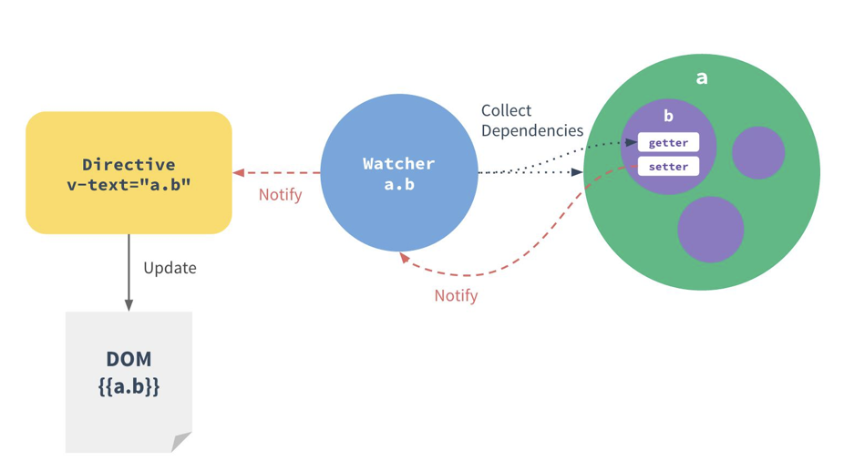

## Vue常见面试题

#### 1、谈谈你对Vue的认识
Vue.js 是一个基于MVVM模式的一套渐进式框架。它是以数据驱动和组件化的思想构建的，采用自底向上增量开发的设计。相比于Angular.js，Vue.js提供了更加简洁、更易于理解的API，使得我们能够快速地上手并使用Vue.js。Vue (读音 /vjuː/，类似于 view) 是一套用于构建用户界面的渐进式框架。与其它大型框架不同的是，Vue 被设计为可以自底向上逐层应用。Vue 的核心库只关注视图层，不仅易于上手，还便于与第三方库或既有项目整合。另一方面，当与现代化的工具链以及各种支持类库结合使用时，Vue 也完全能够为复杂的单页应用提供驱动。

#### 2、Vue的生命周期
- 创建阶段
    `beforeCreate`：vue实例的挂载元素el和数据对象data都是undefined，还没有初始化
    `created`：vue实例的数据对象data有了，可以访问里面的数据和方法，未挂载到DOM，el还没有
- 挂载阶段
    `beforeMount`：vue实例的el和data都初始化了，但是挂载之前为虚拟的dom节点
    `mounted`：vue实例挂载到真实DOM上，就可以通过DOM获取DOM节点
- 更新阶段
    `beforeUpdate`：响应式数据更新时调用，发生在虚拟DOM打补丁之前，适合在更新之前访问现有的DOM，比如手动移除已添加的事件监听器
    `updated`：虚拟DOM重新渲染和打补丁之后调用，组成新的DOM已经更新，避免在这个钩子函数中操作数据，防止死循环
- 销毁阶段
    `beforeDestroy`：实例销毁前调用，实例还可以用，this能获取到实例，常用于销毁定时器，解绑事件
    `destroyed`：实例销毁后调用，调用后所有事件监听器会被移除，所有的子实例都会被销毁
- 特殊的钩子
    `nextTick`：将回调延迟到下次 DOM 更新循环之后执行
    `forceUpdate`：强制刷新组件生命周期

#### 3、Vue父子组件的生命周期执行顺序
- 加载渲染过程
　　父beforeCreate -> 父created -> 父beforeMount -> 子created -> 子beforeMount -> 子mounted -> 父mounted
- 子组件更新过程
　　父beforeUpdate -> 子beforeUpdate -> 子updated -> 父updated
- 父组件更新过程
　　父beforeUpdate -> 父updated
- 销毁过程
　　父beforeDestroy -> 子beforeDestroy -> 子destroyed -> 父destroyed

#### 4、Vue的响应式属性原理
实例化过程中，Vue会遍历data下所有的属性，并通过Object.defineProperty()把它们设置为存储器属性，并写入Vue的实例。而存储器属性是一种响应式属性，是属性中的一种类别，区别于值属性，它有configurable（可配置性）、eumerable（可枚举性）、get和set等特性，其中在读取属性时（即对象属性发生改变时程序会自动读取属性），执行get中的函数，在主动设置属性时，会执行set函数中的代码并传入修改的值。

#### 5、Vue的单文件组件中的局部样式原理
给当前组件的html添加自定义属性 `data-v-[hash]`， 利用css的属性选择器

#### 6、Vue中的data为什么必须是函数
每一个vue组件都是一个vue实例，通过new Vue()实例化，引用同一个对象，如果data直接是一个对象的话，那么一旦修改其中一个组件的数据，其他组件相同数据就会被改变。
而data是函数的话，每个vue组件的data都因为函数有了自己的作用域，互不干扰。

#### 7、mounted 钩子里面使用 this.$refs.xxx 获取节点，为什么打印出来的却是undefined？
mounted生命周期时，DOM结构已经渲染出来了，但是如果在DOM结构中的某个DOM节点使用了v-if、v-show或者v-for（即根据获得的后台数据来动态操作DOM，即响应式），那么这些DOM是不会再mounted阶段找到的。所以如果在mounted钩子中使用$refs，如果ref是定位在有v-if、v-for、v-show中的DOM节点，这些判断下的DOM还没渲染，返回来的只能是undefined，因为在mounted阶段他们根本不存在！！！
如果说mounted阶段是加载阶段，那么updated阶段则是完成了数据更新到DOM的阶段(对加载回来的数据进行处理)，此时，ref、数据等等全部都挂载到DOM结构上去，在update阶段使用this.$refs.xxx，就100%能找到该DOM节点。updated与mounted不同的是，在每一次的DOM结构更新，vue都会调用一次updated(){}钩子函数！而mounted仅仅渲染完成时只执行一次而已。简单来说，只要在调试的时候，能看到元素的存在，在updated阶段或nextTick都可以使用this.$refs.xxx找到对应的DOM节点！

#### 8、V-model双向数据绑定的原理是什么？
v-model，一般用于表单元素，会忽略所有表单元素的 value、checked、selected 特性的初始值而总是将 Vue 实例的数据作为数据来源。
而它的原理，可以分为两步去解释：
Model -> View （数据 ->视图） 原理：响应式属性（getter&setter）
View -> Model （视图->数据） 原理：事件
v-model（双向数据绑定）等同于  单向绑定 + 事件（ v-bind + v-on）

#### 9、Vue的组件通讯有哪些？
1、父传子：props
2、子传父：1、传递父组件的方法给子组件,子组件调用父组件方法对父组件的data进行修改；2、使用自定义事件（推荐），子组件使用$emit触发父组件绑定给子组件的方法。3、事件`sync`修饰符（简单数据可采用方案）
3、兄弟组件通信：
- 若是有共同父级，一般这个需要通讯的数据就放在父组件上
- 没有直接共同父级，无关联/多层级组件间通讯：
    - 利用一个Vue实例（根组件或专门用于通讯的bus组件）作为中间桥梁实现传参，接收方（组件B）：监听bus的自定义事件 bus.$on('自定义事件名'，自定义事件函数)；传输方（组件A）：触发bus的自定义事件bus.$emit('自定义事件名'，要传的参数)
    - 使用Vuex仓库

#### 10、如何添加响应式属性？
1、Vue实例化时配置data（只有第一层数据为响应式属性）
2、使用`Vue.set(target,key,value)` 、 `vm.$set(target,key,value)`
3、数组的变异方法

#### 11、vuex的流程？
页面通过mapAction异步提交事件到action。action通过commit把对应参数同步提交到mutation。
mutation会修改state中对于的值。 最后通过getter把对应值跑出去，在页面的计算属性中
通过mapGetter来动态获取state中的值

#### 12、vuex有哪几种状态和属性？
- state中保存着共有数据，数据是响应式的
- getter可以对state进行计算操作，主要用来过滤一些数据，可以在多组件之间复用
- mutations定义的方法动态修改state中的数据，通过commit提交方法，方法必须是同步的
- actions将mutations里面处理数据的方法变成异步的，就是异步操作数据，通store.dispatch来分发actions，把异步的方法写在actions中，通过commit提交mutations，进行修改数据。
- modules：模块化vuex

#### 13、vue路由的两种模式？
- hash ——即地址栏URL中的#符号（此hsah 不是密码学里的散列运算）
hash 虽然出现URL中，但不会被包含在HTTP请求中，对后端完全没有影响，因此改变hash不会重新加载页面。
- history ——利用了HTML5 History Interface 中新增的pushState() 和replaceState() 方法

这两个方法应用于浏览器的历史记录站，在当前已有的back、forward、go 的基础之上，它们提供了对历史记录进行修改的功能。只是当它们执行修改是，虽然改变了当前的URL，但你浏览器不会立即向后端发送请求。

#### 14、vue 中 key 值的作用？
当 Vue.js 用v-for正在更新已渲染过的元素列表时，它默认用“就地复用”策略。 如果数据项的顺序被改变，Vue 将不会移动 DOM 元素来匹配数据项的顺序，而是简单复用此处每个元素，并且确保它在特定索引下显示已被渲染过的每个元素。key的作用主要是 Vue 识别DOM节点的一个通用机制，将DOM节点唯一标识（用于diff算法）。
- 无key: 复用原则，因为没有key对节点进行唯一标识，Vue对相同的元素进行展示排序等操作时，遵循“就地复用”原则，因为这样更加高效，性能更好，但对于依赖子组件状态或临时 DOM 状态 (如：表单输入值、复选框选中等)的列表，会出现操作混乱的问题
- 有key：指定key属性后，对有key的节点进行了唯一标识，也就意为去掉“就地复用”特性（建议尽可能在使用 v-for 时提供 key，使循环出来的节点（同级同类型的元素）不出现混乱）

#### 15、vue 的数据流向？
- 单向数据流：vue和react框架就是单向数据流，父组件数据修改后会自动更新到子组件，反之不成立（子组件不可修改父组件的数据）
- 双向数据流：angular框架的第1版本用的就是双向数据流（会很复杂）

#### 16、vue 的常用内置组件有哪些？
`<component>`：动态组件
`<keep-alive>`：缓存组件
`<slot>`：插槽内容
`<router-link>`：插槽内容
`<transition>`：用于单个元素动画
`<transition-group>`：用于多个元素并解析为一个标签（默认:span）

#### 17、vue 路由的导航方式有哪些？
- 声明式导航：利用vuerouter的内置组件 `<router-link>` 标签来实现路由跳转
- 编程式导航：
    1、$router.push；会生成浏览器记录
    2、$router.replace；不会生成浏览器记录
    3、$router.go() / $router.back() / $router.forward()

#### 18、vue 路由的传参方式有哪些？
参数都是存进路由实例router里面，在组件中通过this.$route获取当前路由信息，包含传入的参数（params/query等））想要参数刷新存在，又不显示在url中，可用动态路由和params的配合，如果数据较大则用浏览器的本地存储。
1、params传参，只支持name方式跳转，要传的参数不显示在URl，页面刷新后参数不存在
2、query传参，要传的参数显示在URl，页面刷新后参数依然存在
3、动态路由传参，传的参数显示在URl，配合params获取参数，刷新后params的参数依然存在
例：
```js
routes:[{
    path:'/user/:id',//这里的id会自动进入params里面以id为键名
    component:User
}]
```
4、路由定义时传参，
- Boolean模式
```js
routes:[{
    path:'/user/:id',
    component:User,
    props:true //等效于：<User v-bind="route.params"/>
}]
```
- Object模式
```js
 routes:[
        {
            path:'/user/:id',
            component:User,
            props:{myname:'luohongxin'} //等效于：<User v-bind="{myname:'luohongxin'}"
        }
    ]
```
- Function模式
```js
 routes:[
        {
            path:'/settings',
            component:Settings,
            props:(route) => ({ query: route.query.q }) 
        }
    ]
```


#### 19、动态路由需要注意什么问题？
当路由从 /user/1 导航到 /user/2 进行动态路由传参时，组件实例会被复用（因为两个路由都渲染同个user路由下的组件，比起销毁再创建，复用则显得更加高效）因此不会执行组件的生命周期钩子函数，组件确实进行了跳转但是网页需要刷新才能渲染。
解决方案：
设置watch监听或是利用路由导航监听编程式导航的$route的变化，一旦组件变化就重新进行页面初始化操作，这样就不需要手动刷新渲染。

#### 20、路由守卫都有哪些？它们的执行顺序都是怎样的？
路由导航过程中分别执行的函数，完整的导航解析流程如下：
导航被触发。
在失活的组件里调用 `beforeRouteLeave` 离开守卫。
调用全局的 `beforeEach` 守卫。
在重用的组件里调用 `beforeRouteUpdate` 守卫 (2.2+)。
在路由配置里调用 `beforeEnter。`
解析异步路由组件。
在被激活的组件里调用 `beforeRouteEnter。`
调用全局的 `beforeResolve` 守卫 (2.5+)。
导航被确认。
调用全局的 `afterEach` 钩子。
触发 DOM 更新。

#### 21、vue常用的修饰符有哪些？
- stop：阻止事件的冒泡
- prevent：阻止事件的默认行为
- once：只触发一次
- self：只触发自己的事件行为时，才会执行

#### 22、vue项目中的性能优化？
1.不要在模板里面写过多表达式
2.循环调用子组件时添加key
3.频繁切换的使用v-show，不频繁切换的使用v-if
4.尽量少用float，可以用flex
5.按需加载，可以用require或者import()按需加载需要的组件
6.路由懒加载

#### 23、vue.extend和vue.component的区别？
extend - 是构造一个组件的语法器。
然后这个组件你可以作用到Vue.component这个全局注册方法里
还可以在任意vue模板里使用组件。
也可以作用到vue实例或者某个组件中的components属性中并在内部使用apple组件。
Vue.component - 你可以创建 ，也可以取组件。

#### 24、谈谈你对Vuex的理解？
Vuex 是 Vue 的 store，在遇到一些无法用寻常通讯解决的数据交互的问题时候，就可以考虑使用 Vuex，具有以下四个概念：
- <b>state</b>：state就是 Vuex 中的公共的状态, 用于保存所有组件的一些公共数据，使用时通过 `mapState` 把 state 中的数据映射到 computed 中
- <b>getters</b>：对state的数据信息进行处理返回，不能修改state的数据，使用时通过 `mapGetters` 把 getters 中返回的数据映射到 computed 中
- <b>mutations</b>：是存放处理数据的方法的集合，只有mutations能更改state数据，使用时通过 `mapMutations` 把 mutations 中的方法映射到 methods 中
- <b>actions</b> ：actions中可以包含异步操作, mutations中绝对不允许出现异步，异步操作一般在actions，使用时通过 `mapActions` 把 actions 中的方法映射到 methods 中

#### 25、Vue组件中写name选项有除了搭配keep-alive还有其他作用么？你能谈谈你对keep-alive了解么？（平时使用和源码实现方面）
<b>一、组件中写 name 选项有什么作用？</b>
1、项目使用 keep-alive 时，可搭配组件 name 进行缓存过滤
2、DOM 做递归组件时需要调用自身 name
3、vue-devtools 调试工具里显示的组见名称是由vue中组件name决定的
<b>二、keep-alive使用</b>
1、keep-alive 是 Vue 内置的一个组件，可以使被包含的组件保留状态，避免重新渲染
2、一般结合路由和动态组件一起使用，用于缓存组件；
3、提供 include 和 exclude 属性，两者都支持字符串或正则表达式， include 表示只有名称匹配的组件会被缓存，exclude 表示任何名称匹配的组件都不会被缓存 ，其中 exclude 的优先级比 include 高；
4、对应两个钩子函数 activated 和 deactivated ，当组件被激活时，触发钩子函数 activated，当组件被移除时，触发钩子函数 deactivated。
<b>三、keep-alive实现原理</b>
```js
// 源码位置：src/core/components/keep-alive.js
export default {
  name: 'keep-alive',
  abstract: true, // 判断当前组件虚拟dom是否渲染成真是dom的关键

  props: {
    include: patternTypes, // 缓存白名单
    exclude: patternTypes, // 缓存黑名单
    max: [String, Number] // 缓存的组件实例数量上限
  },

  created () {
    this.cache = Object.create(null) // 缓存虚拟dom
    this.keys = [] // 缓存的虚拟dom的健集合
  },

  destroyed () {
    for (const key in this.cache) { // 删除所有的缓存
      pruneCacheEntry(this.cache, key, this.keys)
    }
  },

  mounted () {
    // 实时监听黑白名单的变动
    this.$watch('include', val => {
      pruneCache(this, name => matches(val, name))
    })
    this.$watch('exclude', val => {
      pruneCache(this, name => !matches(val, name))
    })
  },

  render () {
    // .....
  }
}
```
第一步：获取keep-alive包裹着的第一个子组件对象及其组件名；
第二步：根据设定的黑白名单（如果有）进行条件匹配，决定是否缓存。不匹配，直接返回组件实例（VNode），否则执行第三步；
第三步：根据组件ID和tag生成缓存Key，并在缓存对象中查找是否已缓存过该组件实例。如果存在，直接取出缓存值并更新该key在this.keys中的位置（更新key的位置是实现LRU置换策略的关键），否则执行第四步；
第四步：在this.cache对象中存储该组件实例并保存key值，之后检查缓存的实例数量是否超过max的设置值，超过则根据LRU置换策略删除最近最久未使用的实例（即是下标为0的那个key）。
第五步：最后并且很重要，将该组件实例的keepAlive属性值设置为true。
最后就是再次渲染执行缓存和对应钩子函数了

#### 26、Vue 为什么要用 vm.$set() 解决对象新增属性不能响应的问题 ？你能说说如下代码的实现原理么？
Vue使用了Object.defineProperty实现双向数据绑定，在初始化实例时对data函数里返回的对象属性执行 getter/setter 转化，所以属性必须在data对象上存在才能让Vue将它转换为响应式的（这也就造成了Vue无法检测到对象属性的添加或删除），因此Vue提供了Vue.set (object, propertyName, value) / vm.$set (object, propertyName, value)去解决这个问题。
原理：
```js
export function set (target: Array<any> | Object, key: any, val: any): any {
  if (process.env.NODE_ENV !== 'production' &&
    (isUndef(target) || isPrimitive(target))
  ) {
    warn(`Cannot set reactive property on undefined, null, or primitive value: ${(target: any)}`)
  }
  // target 为数组 
  if (Array.isArray(target) && isValidArrayIndex(key)) {
    // 修改数组的长度, 避免索引>数组长度导致splcie()执行有误
    target.length = Math.max(target.length, key)
    // 利用数组的splice变异方法触发响应式  
    target.splice(key, 1, val)
    return val
  }
  // Vue 实例中的 key 已经存在，直接修改属性值  
  if (key in target && !(key in Object.prototype)) {
    target[key] = val
    return val
  }
  const ob = (target: any).__ob__
  if (target._isVue || (ob && ob.vmCount)) {
    process.env.NODE_ENV !== 'production' && warn(
      'Avoid adding reactive properties to a Vue instance or its root $data ' +
      'at runtime - declare it upfront in the data option.'
    )
    return val
  }
  // target 本身就不是响应式数据, 直接赋值
  if (!ob) {
    target[key] = val
    return val
  }
  // 对属性进行响应式处理
  defineReactive(ob.value, key, val)
  ob.dep.notify()
  return val
}
```
我们阅读以上源码可知，vm.$set 的实现原理是：
1、如果目标是数组，直接使用数组的 splice 方法触发相应式；
2、如果目标是对象，会先判读属性是否存在、对象是否是响应式，
3、最终如果要对属性进行响应式处理，则是通过调用 defineReactive 方法进行响应式处理
`defineReactive` 方法就是 Vue 在初始化对象时，给对象属性采用 Object.defineProperty 动态添加 getter 和 setter 的功能所调用的方法：
```js
export function defineReactive (
  obj: Object,
  key: string,
  val: any,
  customSetter?: ?Function,
  shallow?: boolean
) {
  const dep = new Dep()

  const property = Object.getOwnPropertyDescriptor(obj, key)
  if (property && property.configurable === false) {
    return
  }

  // cater for pre-defined getter/setters
  const getter = property && property.get
  const setter = property && property.set
  if ((!getter || setter) && arguments.length === 2) {
    val = obj[key]
  }

  let childOb = !shallow && observe(val)
  Object.defineProperty(obj, key, {
    enumerable: true,
    configurable: true,
    get: function reactiveGetter () {
      const value = getter ? getter.call(obj) : val
      if (Dep.target) {
        dep.depend()
        if (childOb) {
          childOb.dep.depend()
          if (Array.isArray(value)) {
            dependArray(value)
          }
        }
      }
      return value
    },
    set: function reactiveSetter (newVal) {
      const value = getter ? getter.call(obj) : val
      /* eslint-disable no-self-compare */
      if (newVal === value || (newVal !== newVal && value !== value)) {
        return
      }
      /* eslint-enable no-self-compare */
      if (process.env.NODE_ENV !== 'production' && customSetter) {
        customSetter()
      }
      // #7981: for accessor properties without setter
      if (getter && !setter) return
      if (setter) {
        setter.call(obj, newVal)
      } else {
        val = newVal
      }
      childOb = !shallow && observe(newVal)
      dep.notify()
    }
  })
}
```

#### 27、既然 Vue 通过数据劫持可以精准探测数据在具体dom上的变化,为什么还需要虚拟 DOM 的 diff算法 呢?
现代前端框架有两种方式侦测变化，一种是 pull ，一种是 push

pull: 其代表为React，我们可以回忆一下React是如何侦测到变化的,我们通常会用setStateAPI显式更新，然后React会进行一层层的Virtual Dom Diff操作找出差异，然后Patch到DOM上，React从一开始就不知道到底是哪发生了变化，只是知道「有变化了」，然后再进行比较暴力的Diff操作查找「哪发生变化了」，另外一个代表就是Angular的脏检查操作。

push: Vue的响应式系统则是push的代表，当Vue程序初始化的时候就会对数据data进行依赖的收集，一但数据发生变化,响应式系统就会立刻得知。因此Vue是一开始就知道是「在哪发生变化了」，但是这又会产生一个问题，如果你熟悉Vue的响应式系统就知道，通常一个绑定一个数据就需要一个Watcher（具体如何创建的Watcher可以先了解下Vue双向数据绑定的原理如下图）

一但我们的绑定细粒度过高就会产生大量的Watcher，这会带来内存以及依赖追踪的开销，而细粒度过低会无法精准侦测变化,因此Vue的设计是选择中等细粒度的方案,在组件级别进行push侦测的方式,也就是那套响应式系统,通常我们会第一时间侦测到发生变化的组件,然后在组件内部进行Virtual Dom Diff获取更加具体的差异，而Virtual Dom Diff则是pull操作，Vue是push+pull结合的方式进行变化侦测的。

#### 28、 为什么Vuex的mutation不能执行异步，异步操作要在actions执行？
Vuex中所有的状态更新的唯一途径都是mutation，异步操作通过 Action 来提交 mutation实现，每个mutation执行完成后都会对应到一个新的状态变更，这样们可以方便地跟踪每一个状态的变化，devtools就可以打个快照存下来，然后就可以实现 time-travel 了。如果在mutation做异步操作，就没有办法知道状态是何时更新的，无法很好的用devtools进行状态的追踪，给调试带来困难。

#### 29、 Vue.js虚拟DOM的优缺点？
1）优点
保证性能下限： 框架的虚拟 DOM 需要适配任何上层 API 可能产生的操作，它的一些 DOM 操作的实现必须是普适的，所以它的性能并不是最优的；但是比起粗暴的 DOM 操作性能要好很多，因此框架的虚拟 DOM 至少可以保证在你不需要手动优化的情况下，依然可以提供还不错的性能，即保证性能的下限；
无需手动操作 DOM： 我们不再需要手动去操作 DOM，只需要写好 View-Model 的代码逻辑，框架会根据虚拟 DOM 和 数据双向绑定，帮我们以可预期的方式更新视图，极大提高我们的开发效率；
跨平台： 虚拟 DOM 本质上是 JavaScript 对象,而 DOM 与平台强相关，相比之下虚拟 DOM 可以进行更方便地跨平台操作，例如服务器渲染、weex 开发等等。
2）缺点
无法进行极致优化： 虽然虚拟 DOM + 合理的优化，足以应对绝大部分应用的性能需求，但在一些性能要求极高的应用中虚拟 DOM 无法进行针对性的极致优化。比如VScode采用直接手动操作DOM的方式进行极端的性能优化

#### 30、React与Vue对比
- 相似点：
  * 使用 Virtual DOM
  * 提供了响应式 (Reactive) 和组件化 (Composable) 的视图组件。
  * 将注意力集中保持在核心库，而将其他功能如路由和全局状态管理交给相关的库。
- 区别：
  * 在 React 应用中，旧版本是直接递归对比发现数据结构不同时删除当前节点然后创建一个新的数据节点，react新版本的话 就是把要更新的数据先打上标签等所有执行线程执行完后 再去执行有标签的数据的刷新 。当某个组件的状态发生变化时，它会以该组件为根，重新渲染整个组件子树。如要避免不必要的子组件的重渲染，你需要手动实现；在 Vue 应用中，组件的依赖是在渲染过程中自动追踪的，在vue中每个组件都会被全局watch监听所以vue在新旧dom对比是从子组件开始对比的而且是只会对比watch新旧dom不同的组件，所有能做到局部刷新 ，所以系统能精确知晓哪个组件确实需要被重渲染，开发者不需要考虑组件是否需要重新渲染之类的优化。
  * 在React中，一切都是JavaScript，所有的组件的渲染功能都依靠 JSX。JSX 是使用 XML 语法编写 JavaScript 的一种语法糖。你可以使用完整的编程语言 JavaScript 功能来构建你的视图页面；在Vue中有自带的渲染函数，Vue也支持JSX，Vue官方推荐使用模板渲染视图。组件分为逻辑类组件和表现类组件。
  * 组件作用域内的CSS。CSS 作用域在 React 中是通过 CSS-in-JS 的方案实现的；在Vue中是通过给style标签加scoped标记实现的。
  * Vue 的路由库和状态管理库都是由官方维护支持且与核心库同步更新的。React 则是选择把这些问题交给社区维护，因此创建了一个更分散的生态系统。