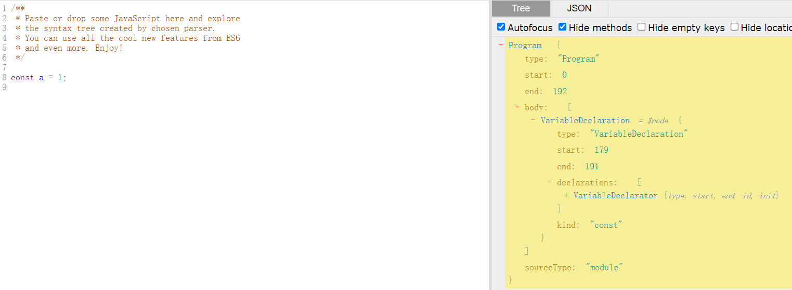
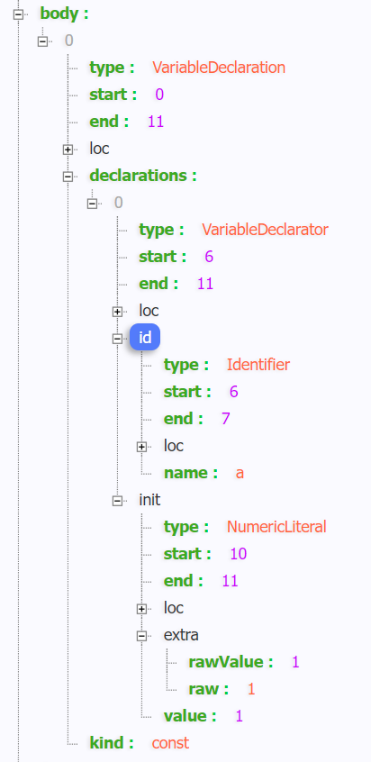
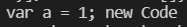
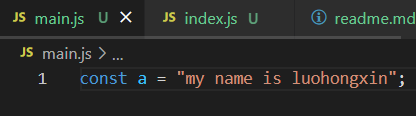
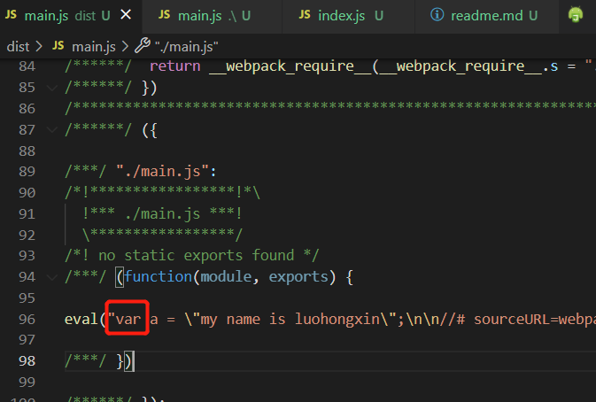

[TOC]

### 执行本项目
前提全局安装了 webpack 指令
```shell
npm install
npm start
```
## babel开发

### 前置知识
学习 babel 前，必须要了解的核心概念就是 AST。<br/>
同时，希望你的项目中已经安装好了 babel 相关依赖。
```shell
npm install --save-dev @babel/core @babel/cli @babel/preset-env
npm install --save @babel/polyfill
```

#### 什么是 AST ？
来自百科的解释：
<div style="background-color:rgb(255, 245, 227);padding:2px 10px;margin:10px 0">
在计算机科学中，抽象语法树（Abstract Syntax Tree，AST），或简称语法树（Syntax tree），是源代码语法结构的一种抽象表示。它以树状的形式表现编程语言的语法结构，树上的每个节点都表示源代码中的一种结构
</div>
<b>"源代码语法结构的一种抽象表示"</b>，注意这句话，它是我们理解 AST 的关键。这句话大概的意思就是，按照某种约定的规范，以树形的数据结构，把我们的代码描述出来，让 JS 引擎和转义器能够理解。
<div style="margin-top:20px">
举个栗子：react、vue等前端框架中的虚拟DOM，其实就是把 HTML 的真实DOM描绘成 JS 的虚拟机DOM。对将在页面真实DOM修改的操作，在 JS 的虚拟DOM上执行一遍，从而得到最终的DOM结构，最后才反映到真实DOM上，以此减少对真实DOM的操作，降低对浏览器性能的消耗。而对于底层的代码来说，AST 就相对于它们的虚拟机DOM。
</div>
<div style="margin-top:20px">
当然，AST 不是 JS 特有的，每个语言都可以转换成对应的 AST，并且 AST 结构的规范也有很多，不同的语言对应不同的规范，而 JS 使用的规范大部分是 <a href="https://github.com/estree/estree">estree</a>，对于这个规范我们只做简单的了解即可。
</div>

#### AST 长什么样？
对 AST 有个基本的理解后，那 AST 到底长什么样？
<a href="https://astexplorer.net/">astexplorer.net</a> 这个网站可以在线生成AST, 我们可以在里面进行尝试生成AST，用来学习一下 AST 的结构。
如下图：左边是代码，仅声明常量 const a = 1;右边是 AST 结构 


### babel处理过程
在了解完 AST 后，我们可以开始进入 babel 的学习了。
首先，babel 作为我们即熟悉又陌生的工具，它帮我们处理代码的时候，大致分为以下几步。
<ol>
<li>
解析，对代码进行 AST 编译，得到代码的 AST 结构 
</li>
<li>
转换，按我们的要求，对代码的 AST 进行处理，得到处理后的 AST 结构 
</li>
<li>
生成，将 AST 转回成并生成我们的目标代码
</li>
</ol> 
#### 解析
通过 parser 把源码转换成抽象语法书 AST 。
这个阶段的主要任务就是把代码转成 AST，其中经过两个阶段，一个是<b>词法解析</b>和<b>语法解析</b>。当 parser 阶段开始时，首先会进行文档扫描，并在此期间进行词法分析。举例："const a = 1" 会被词法分析拆解为颗粒度最细的标记<b>（tokens）</b>： "const"、"a"、"="、"1"。
<div style="margin-top:20px">
词法分析结束后，将分析得到的 <b>tokens</b> 交给语法分析。而语法分析的主要任务就是根据 <b>tokens</b> 生成 AST。它会对 <b>tokens</b> 进行遍历，最终生成特定结构的 tree，而这个 tree 就是 AST。
</div>
以 <code>const a = 1</code> 为例：

```js
{"type":"File","start":0,"end":11,"loc":{"start":{"line":1,"column":0},"end":{"line":1,"column":11}},"errors":[],"program":{"type":"Program","start":0,"end":11,"loc":{"start":{"line":1,"column":0},"end":{"line":1,"column":11}},"sourceType":"script","interpreter":null,"body":[{"type":"VariableDeclaration","start":0,"end":11,"loc":{"start":{"line":1,"column":0},"end":{"line":1,"column":11}},"declarations":[{"type":"VariableDeclarator","start":6,"end":11,"loc":{"start":{"line":1,"column":6},"end":{"line":1,"column":11}},"id":{"type":"Identifier","start":6,"end":7,"loc":{"start":{"line":1,"column":6},"end":{"line":1,"column":7},"identifierName":"a"},"name":"a"},"init":{"type":"NumericLiteral","start":10,"end":11,"loc":{"start":{"line":1,"column":10},"end":{"line":1,"column":11}},"extra":{"rawValue":1,"raw":"1"},"value":1}}],"kind":"const"}],"directives":[]},"comments":[]}
```
我截图了关键部分，如下图所示，包裹的外层 <code>type</code> 为 <code>VariableDeclaration</code>，从单词意思可得知是声明，所使用的 <code>kind</code> 是 <code>const</code> 类型声明。而字段 <code>declarations</code> 描述中，还有 <code>VariableDeclarator</code> 声明对象，id 为声明对象的名称，同样也是个对象，它的 name 才是声明对象名称的值，init 为声明对象初始化的值（还是对象），里面的 value 才是这个初始值。

除了上面所说的字段外，还有包括第几行，第几列，值类型等详细信息。这就是我们所得到的 AST。
<div style="margin-top:20px">
那在开发过程中，我们如何将代码转换为 AST 呢？这就需要 babel 提供的解析器 <b>@babel/parser</b>，之前叫 Babylon，它并非 babel 团队开发的，而是基于 fork 的 acorn 项目。
</div>
使用过程（已按照babel相关依赖）：
```js
const parser = require('@babel/parser');
const ast = parser.parse('const a = 1'); // 转换成AST
```
更多信息可以访问官方文档查看 <a href="https://babel.docschina.org/docs/en/7.7.0/usage/">@babel/parser</a>

#### 转换
在 parse 解析阶段，我们已经成功得到 AST 了。babel 接受到 AST 后，会使用 <b>@babel/traverse</b> 对其进行深度优先遍历，插件会在这个阶段被触发，以 visitor 函数的形式，访问每种不同类型的 AST 节点。已上述为例，我们可以使用 <code>VariableDeclaration</code> 函数对 <code>VariableDeclaration</code>节点进行回调处理，每个该类型的节点，都会触发这个函数回调：
```js
const parser = require('@babel/parser');

const traverse = require('@babel/traverse').default

const ast = parser.parse('const a = 1'); // 转换成AST

traverse(ast, {
    VariableDeclaration(path, state) {
        // 操作处理...
    }
});
```
这个函数有两个形参：
##### path
path为当前访问的路径, 包含了节点的信息、父节点信息以及对节点操作的方法。可以利用这些方法，对 ATS 进行添加、更新、移动和删除等等操作。
##### state
state包含了当前plugin插件的信息和参数信息等等，并且也可以用来自定义在节点之间传递数据。

#### 生成
最后的阶段就是 <b>generate</b>，把转换后的 AST 打印成目标代码，并生成 <b>sourcemap</b>
这个阶段就比较简单了， 在转换阶段处理 AST 结束后，将 AST 转换回 code, 在此期间会对 AST 进行深度优先遍历，根据节点所包含的信息生成对应的代码，并且会生成对应的 <b>sourcemap</b>。

### 实例操作
代码学习不能只会看，必须得亲自动手，才能深度的学习。接下来我们要写一个最简单的例子，就是把 ES6 中的 <code>const</code> 转变为 ES5 的 <code>var</code>
根据上面的步骤，我们逐步进行：
#### 解析得到 AST
使用 <code>@babel/parser</code> 生成AST
比较简单，跟上面的案例是一样的，其中 ast 常量就是转换后的 AST
```js
const parser = require('@babel/parser');
const ast = parser.parse('const a = 1'); // 转换成AST
```

#### 转换处理 AST
使用 <code>@babel/traverse</code> 处理 AST
在这个阶段，我们通过分析所生成的 AST 结构，在 VariableDeclaration 回调中确定 kind 字段会有 const，我们只需将 kind 字段修改为 var 即可。
```js
const parser = require('@babel/parser');
const traverse = require('@babel/traverse').default
const ast = parser.parse('const a = 1'); // 转换成AST
traverse(ast, {
    // 声明变量都会触发这个VariableDeclaration函数
    VariableDeclaration(path, state) {
        // 通过 path.node 访问实际的 AST 节点
        path.node.kind = 'var'
    }
});
```

#### 生成代码
最后一步，则是使用 <code>@babel/generator</code> 把处理好的 AST 转换回我们的代码。
```js
const parser = require('@babel/parser');

const traverse = require('@babel/traverse').default

const generate = require('@babel/generator').default

const ast = parser.parse('const a = 1'); // 转换成AST
// 转换回code代码
traverse(ast, {
    // 声明变量都会触发这个VariableDeclaration函数
    VariableDeclaration(path, state) {
        // 通过 path.node 访问实际的 AST 节点
        path.node.kind = 'var'
    }
});

// 将处理好的 AST 放入 generate
const transformedCode = generate(ast).code
console.log(transformedCode,"new Code")
```
最后打印出来的 new Code 结果如下图：


### 如何开发成插件使用
从上面步骤分析可得知，我们重点关注的其实就是转换处理这个阶段。所以开发插件时，我们也只需关注这个阶段就行，另外两步webpack的插件配置已经帮我们做好了。而插件最终只需导出一个函数，该函数需要返回一个对象，而我们只需要改对象的 visitor ，这里就类似 traverse 转换处理阶段即可。
既然是函数，当然会接受几个参数：
<ol>
<li><b>api</b>， 继承了babel提供的一系列方法</li>
<li><b>options</b>， 是我们使用插件时所传递的参数</li>
<li><b>dirname</b>， 为处理时期的文件路径</li>
</ol>
// myplugin.js 文件，将 ES6 声明变量方式转 var 的babel插件代码如下：

```js
module.exports = (api, options, dirname) => {
	return {
		visitor: {
            VariableDeclaration(path, state) {
                path.node.kind = 'var'
            }
	    }
	}
}
```

#### 如何使用我们开发的插件
既然我们开发好了插件，那该怎么使用呢？
当然是通过 babel 和 webpack 去使用啦！

##### 1、首先全局安装 webpack 和 局部安装 babel-loader
既然要使用 webpack ，我们的开发环境自然就需要 webpack 指令（有了就跳过）

```shell
npm install webpack -g
```
还需要 babel-loader 在webpack中，帮助我们加载项目文件
```shell
npm install babel-loader --save
```

##### 2、编写 webpack.config.js 配置文件
通过设置 webpack 相关配置，例如：指定入口文件，使用的加载器，输出文件地址等。
代码如下：
// webpack.config.js
```js
module.exports = {
    mode: "development", // 这里使用开发模式，方便查看输出文件内容
    entry: './main.js',
    // output: {
    //     filename: 'bundle.js' // 可指定输出路径
    // },
    module: {
        rules: [{
            test: /\.js?$/,
            use: ['babel-loader']
        }]
    }
}
```

##### 3、编写 babel 插件配置
第2步已经确定 webpack 会走 babel-loader 加载后，我们就开始配置 babel-loader 的配置。babel 的配置方式有很多种，具体我不细说，这里我就用可共用的方法，通过 .babelrc 文件去设置。
// .babelrc 文件

```js
{
    "plugins":[
        ["./myplugin.js"] // 这里以相对路径的方式引入自己写的插件
    ]
}
```

##### 4、执行webpack打包编译
在 webpack.config.js 目录下，输入如下指令

```shell
webpack
```

##### 5、查看结果
入口文件内容：<br/>
<br/>
打包后输出文件内容：<br/>
<br/>
可以看到，代码是已经成功被转换了。