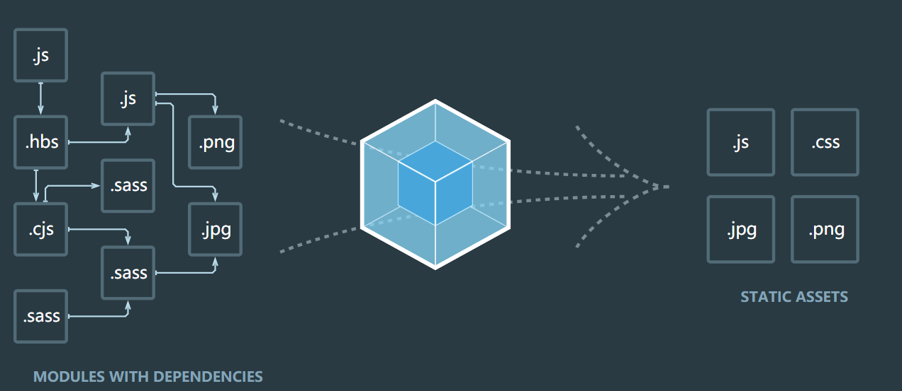

# 学习并总结webpack
### 同时配合多个demo用webpack学习练手


## 概念
本质上， webpack 是一个现代 JavaScript 应用程序的静态模块打包器。当 webpack 处理项目时，它会从入口文件进入，找寻所有的依赖，递归地构建一个依赖关系图，其中会把项目需要的每个模块打包成一个或多个 bundle 压缩文件。

#### webpack的核心概念
- 入口（entry）
- 输出（output）
- loader（module）
- 插件（plugins）

## 入口（entry）
入口 （entry）指示 webpack 使用哪个模块作为构建其内部的 依赖图 开始。进入入口之后，webpack 会找出与入口有依赖关系的所有模块。可在webpack.config.js中配置一个或多个入口。
### 单个入口（简写）语法
用法： ```entry: string|Array<string> ```
```js
module.exports = {
    entry: './main.js'
}
```
或
``` js
module.exports = {
    entry: {
        main: './main.js'
    }
}
```
向entry属性传入 [文件入口路径数组] 将创建多个主入口。在你想要多个依赖文件一起注入，并且最后将它们的依赖导向打包到一个 "chunk" 时，传入数组的方式就很有用了。

### 对象语法
用法：```entry:{[entryChunkName<string>]:string|Array<string>} ```
``` js
module.exports = {
    entry: {
        app: './app.js',
        main: './main.js'
    }
}
```
对象语法会比较繁琐。然而，这是应用程序中定义入口的最可拓展的方式。
###### 应用场景
1、分离 应用程序 app 和第三方 main 入口
2、多页面应用程序 app1、app2、app3

"可拓展的 webpack 配置"是指，可重用并且可以与其他配置组合使用。这是一种流行的技术，用于关注点从环境、构建目标、运行时中分离。然后使用专门的工具将它们合并。

## 出口（output）
出口 output 属性告诉 webpack 在哪里输出它所创建的 bundles，以及如何命名这些文件，path的默认值为 ```./dist ```。注意，即使存在多个 入口 起点，但只指定一个 输出 配置。
### 用法
在 webpack 中配置 ```output ``` 属性最低要求是，将它的值设置为一个对象，包括以下两点：
- ```filename ``` 用于输出文件的文件名
- 输出文件夹 ``` path``` 的绝对路径

``` js
module.exports = {
    output: {
        filename: 'bundle.js',
        path:'/dist'
    }
}
```
#### 多个入口起点情况
如果配置创建了多个单独的"chunk"（例如，使用多个入口起点或使用像CommonsChunkPlugin这样的插件），则应该使用 占位符 来确保每个文件具有唯一的名称
```js
module.exports = {
    entry: {
        app: './app.js',
        main: './main.js'
    },
    output: {
        filename: '[name].js',
        path: _dirname + '/dist'
    }
}
```
###### 占位符
对于单个 入口 起点，filename 会是一个静态名称。
```js
filename: "bundle.js"
```
然而，当通过多个入口起点、代码拆分或各种插件创建多个bundle，则可使用下面替换方式，来赋予每个 bundle 唯一的名称
* hash: 模块标识符的hash
* chunkhash: chunk内容的hash
* name: 模块的名称
* id: 模块标识符
* query: 模块的query，例如，文件名 ? 后面的字符串

## 模式（mode）
提供 ```mode``` 配置选项，告知webpack使用相应模式的内置优化。
#### 用法
```<string>```
只在配置中提供 ```mode``` 选项：
 ```js
module.exports = {
    mode: 'production'
}
 ```
或者从CLI参数中传递：
 ```js
 webpack --mode=production
 ```
支持一下字符串值：
* development：会将 ```process.env.NODE_ENV``` 的值设为 ```development```。启用 ```NamedChunksPlugin``` 和 ```NamedModulesPlugin```
* production：会将 ```process.env.NODE_ENV```的值设为```production```。启用```FlagDependencyUsagePlugin```, ```FlagIncludedChunksPlugin```, ```ModuleConcatenationPlugin```, ```NoEmitOnErrorsPlugin```, ```OccurrenceOrderPlugin```, ```SideEffectsFlagPlugin``` 和 ```UglifyJsPlugin```.

## loader（module）
loader 用于对模块的源代码进行转换。loader 可以使你在 import 或“加载”模块时预处理文件。因此，loader 类似于其他构建工具中“任务（task）”，并提供了处理前端构建步骤的强大方法。loader 可以将文件从不同的语言（如TypeScript）转换为 JavaScript，或将内联图像转换为 data URL。loader 甚至允许你直接在 JavaScript 模块中 import css文件。
#### 简单示例
例如，你可以使用 loader 告诉 webpack 加载 CSS 文件，或者将 TypeScript 转换为 JavaScript。为此，首先安装相对应的 loader：
 ``` js
 npm install --save-dev css-loader
 npm install --save-dev ts-loader
 ```
 然后在 webpack 配置里指示对每个 ```.css``` 文件使用 ```css-loader```，以及对所有 ```.ts``` 文件使用 ```ts-loader```：
 webpack.config.js
  ``` js
  module.exports = {
      module: {
          rules: [
              {test: /\.css$/, use: 'css-loader'},
              {test: /\.ts$/, use: 'ts-loader'}
          ]
      }
  }
  ```
  ### loader的使用
  loader使用的三种方式：
  * 配置（推荐）：在webpack.config.js文件中指定 loader。
  * 内联：在每个 ```import``` 语句中显示指定 loader。
  * CLI：在shell命令中指定它们。
  #### 配置
  ```module.rules``` 允许你在 webpack 配置中指定多个 loader。这是展示 loader 的一种简明方式，并且有助于使代码变得简洁。同时让你对各个 loader 有个全局概览：
   ```js
   module: {
      rules: [
          {
              test:/\.css$/,
              use: [
                  { loader: 'style-loader' },
                  {
                      loader: 'css-loader',
                      options: {
                          modules: true
                      }
                  }
              ]
          }
      ]
   }
   ```
   use里的loader执行顺序是从右到左
   #### 内联
   可以在 ```import``` 语句或任何等效于"import"的方式中指定 loader。使用 ```!``` 将资源中的loader分开。分开的每个部分都相对于当前目录解析。
   ```js
   import Styles from 'style-loader!css-loader?modules!./styles.css';
   ```
   通过前置所有规则及使用 ```!```，可以对应覆盖到配置中的任意loader。
   #### CLI
   通过 CLI 使用loader：
   ```js
   webpack --module-bind jade-loader --module-bind 'css=style-loader!css-loader'
   ```
   对 ```.jade``` 文件使用 ```jade-loader``` ，对 ```.css``` 文件使用 ```style-loader``` 和 ```css-loader```

   ### loader 特性
   * loader 支持链式传递
   * loader 可以是同步的，也可以是异步的
   * loader 运行在Node.js中，并且能够执行任何可能的操作。
   * loader 接收查询参数，用于对 loader 传递配置。
   * loader 也能够使用 options 对象进行配置。
   * 除了使用 package.json 常见的 main 属性，还可以将普通的 npm 模块导出为 loader，做法是在package.json里定义一个 loader 字段。
   * 插件（plugin）可以为 loader 带来更多特性。
   * loader 能够产生额外的任意文件
   ### 解析loader
   loader 遵循标准的模块解析。多数情况下，loader 将从 模块路径 （npm install 的 node_modules）解析。
   loader 模块需要导出为一个函数，并且使用 Node.js 兼容 JavaScript 编写。通常使用 npm 进行管理，但是也可以将自定义 loader 作为应用程序中的文件。按照约定，loader 通常被命名为 xxx-loader. 

   ## 插件plugins
   loader 被用于转换某些类型的模块，而插件则可以用于执行范围更广的任务。插件的范围包括，从打包优化和压缩，一直到重新定义环境中的变量。一般 loader 处理不了的任务，就要考虑用插件了。
  ### 剖析插件
  webpack 插件是一个具有 apply 属性的JavaScript对象。 apply 属性会被 webpack compiler 调用，并且 compiler 对象可在整个编译生命周期访问。
  ConsoleLogOnBuildWebpackPlugin.js
  ```js
  const pluginName = 'ConsoleLogOnBuildWebpackPlugin';
  class ConsoleLogOnBuildWebpackPlugin {
      apply(compiler) {
          compiler.hooks.run.tap(pluginName, compilation => {
              console.log("webpack 构建过程开始！")
          });
      }
  }
  ```
  compiler hook 的 tap 方法的第一个参数，应该是驼峰式命名的插件名称。建议为此使用一个常量，以便它可以在所有hook中复用。

  ### 用法
  由于插件可以携带参数/选项，你必须在 webpack 配置中，向 plugins 属性传入 new 实例。根据你的 webpack 用法，这里有多种方式使用插件。
    
  #### 配置用法
 使用一个插件 ，只需 ```require()``` 插件，然后把它添加到 ```plugins``` 数组中。多数插件可以通过选项（option）自定义。也可以在一个配置文件中因为不同目的而多次使用同一个插件，这时需要通过使用 ```new``` 操作符来创建它的一个实例。
webpack.config.js
```js
const HtmlWebpackPlugin = require('html-webpack-plugin'); // 通过npm安装
const webpack = require('webpack'); // 用于访问内置插件
const path = require('path');

const config = {
    entry: './path/to/my/entry/file.js',
    output: {
       filename: 'xxx.bundle.js',
       path: path.resolve(_dirname,'dist')
    },
    module:{
        rules: [
            {test: /\.txt$/, use: 'raw-loader'}
        ]
    },
    plugins: [
        new HtmlWebpackPlugin({template: './src/index.html'})
    ]
};
module.exports = config;
```

  